# Walkthrough of a Bevy Game
Walkthrough (and maybe Heuristic Evaluation) of Bevy Game, Alien Cake Addict

## User Goal
I will attempt to perform a cognitive walk-through of a game developed with the Bevy framework.  Based on the course recommendation, I want to follow this up with a heuristic evaluation. The https://github.com/bevyengine/bevy/tree/latest/examples#games page gives 2 example games associated with the Github repository.  These games are not done by a third party, but are part of the Bevy project.  
## Tasks to Accomplish the Goal
The first task is to install the game.  The second task is to run it.
## Documented Experience while Attempting to Run the Game
Navigating to download of game.

### Game Installation
#### 1.	At the main page of Bevy, https://github.com/bevyengine/bevy, I scrolled down to Docs and selected The Bevy Book link.

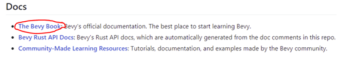
#### 2.	Next, I clicked on 3. next steps on the sidebar.

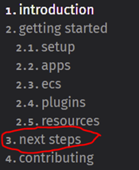
#### 3.	Then I clicked on The Bevy Examples link.

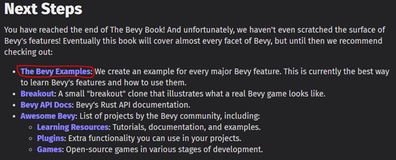
#### 4.	I see that this page explains how to run Examples on the page per the pic below …

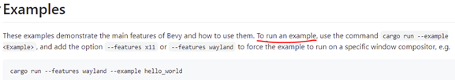
#### 5.	So here I go.  I scroll down to Games and click on the game/alien_cake_addict.rs link.

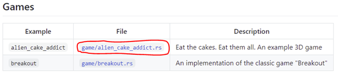
#### 6.	Now I attempt to download by selecting the Open this file in GitHub Desktop icon.

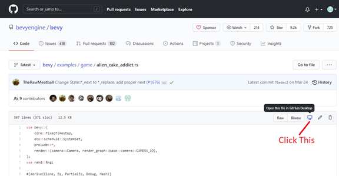
#### 7.	It wants permission, so I gave it by selecting the button.

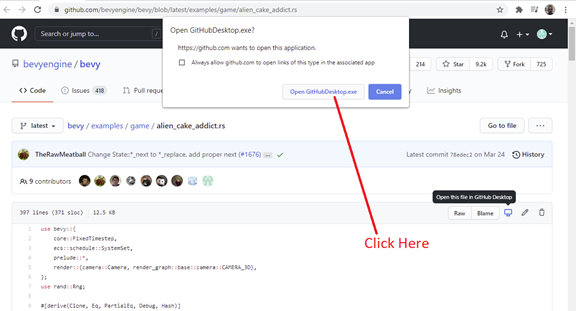
#### 8.	I went ahead and cloned the repository when asked.

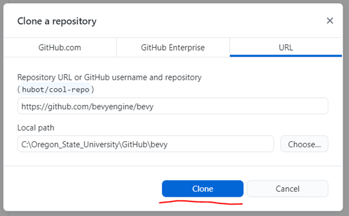
#### 9.	Reminding myself, per Step 4 (shown again below), that my objective is to type: 
#### cargo run –example alien_cake_addict

#### to run the game, I open a Command Prompt window by typing it in the Type here to search box, and pressing the App

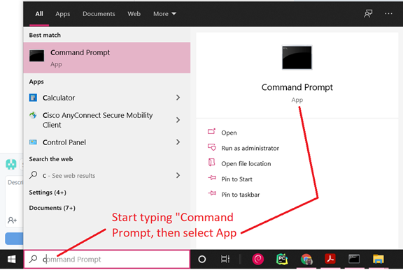
#### 10.	Now I navigate to the directory where the alien_cake_addict.rs file is that I want to run.  The location is partially given in Step 8 in the Local Path box.  I explored the directory a bit to determine that the game is in .\examples\game.

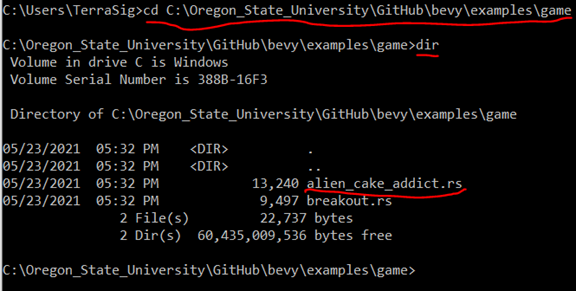
#### 11.	I then type cargo run - - example alien_cake_addict and to my delight a lot of compiling happens 😊.  This takes several minutes.

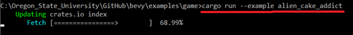
#### I am hopeful that a window will open up and I can start playing the game … but sadly it crashed ☹.

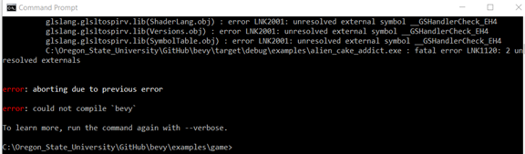
#### 12.	So I try again with the suggestion with - - verbose.  But that also crashed ☹.

#### 13.	So now I googled the error by scrolling back in the Command Prompt window until I found the error that derailed the build:

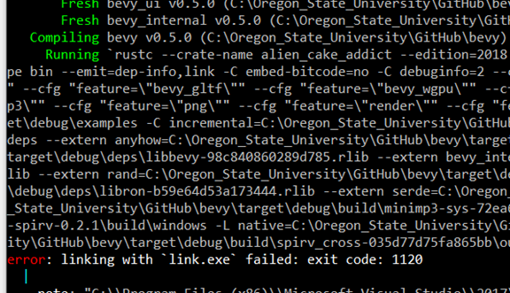
#### Google searching linking with ‘link.exe’ failed: exit code: 1120 led me to https://github.com/gfx-rs/wgpu/issues/464 where a potential solution is given: 
####    cargo update -p cc - -precise 1.0.50
####  per the pic below.

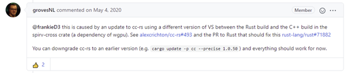
#### 14.	In the Command Prompt window I changed directory to the Bevy repository and ran the above command.

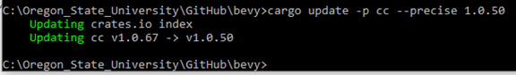
#### Still, there was no success.
#### 15.	I was eventually able to get through this error by following Procedure 29 in the README.md file of https://github.com/mccludav/bevy_win10_install .  However, this only uncovered another error:

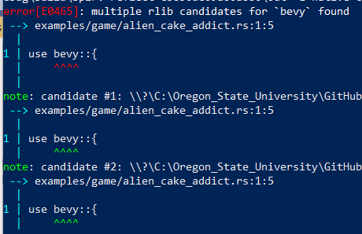
#### 16.	After spending much time trying to resolve this issue, I have given up.  I have found that just 20 days ago someone else reported this problem.  It was also a problem in November of last year per below.  In fact, it has been around for several years.

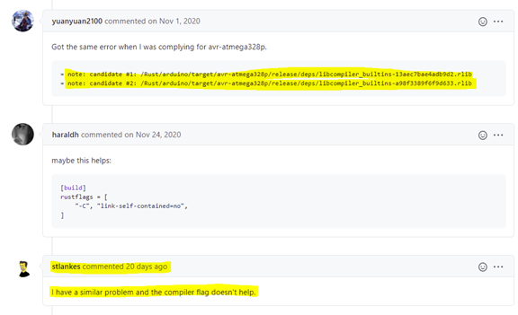
